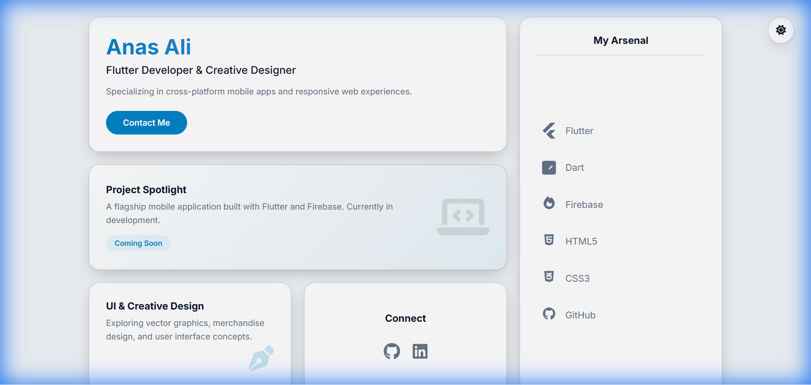

# Anas Ali | Portfolio




A modern, responsive portfolio website featuring a Bento Grid layout and dark/light mode support. Built to showcase my skills as a Flutter Developer and Creative Designer.

## 🌟 Features

-   **Bento Grid Layout**: A clean, grid-based design for showcasing skills and projects effectively.
-   **Dark/Light Mode**: Fully supported theme toggling with persistent user preference (saved in LocalStorage).
-   **Responsive Design**: Optimized for all device sizes, from desktops to mobile phones.
-   **Interactive Elements**: Smooth hover effects and transitions for a premium feel.
-   **Custom Icons**: Integration of Font Awesome and custom SVGs for Flutter and Dart.

## 🛠️ Tech Stack

-   **HTML5**: Semantic structure and accessibility.
-   **CSS3**: Custom styling with CSS variables for theming and Flexbox/Grid for layout.
-   **JavaScript**: Logic for theme toggling and interactivity.
-   **Font Awesome**: Icons for social links and general UI.

## 🚀 Setup & Usage

This is a static website, so no complex build process is required.

1.  **Clone the repository:**
    ```bash
    git clone https://github.com/AnasAli-2722/AnasAli-2722.github.io.git
    ```
2.  **Open the project:**
    Navigate to the project folder and open `index.html` in your preferred web browser.

## 🔗 Live Demo

Check out the live version here: [https://anasali-2722.github.io/](https://anasali-2722.github.io/)

---

© 2025 Anas Ali. All Rights Reserved.
b.io/)

---

© 2025 Anas Ali. All Rights Reserved.
